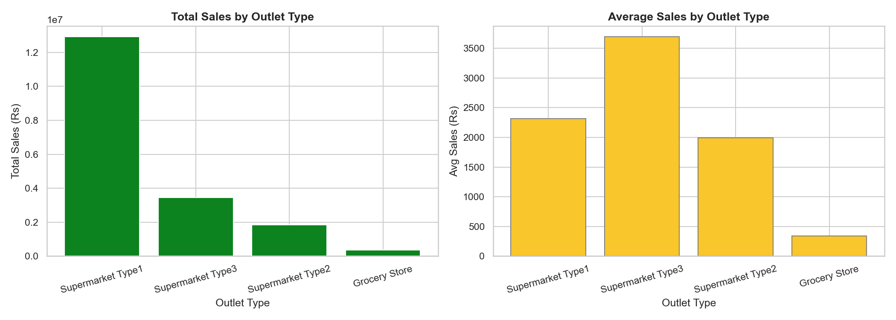
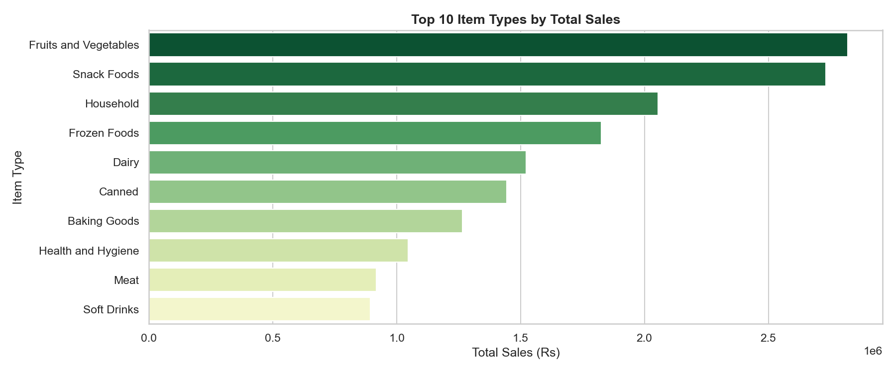
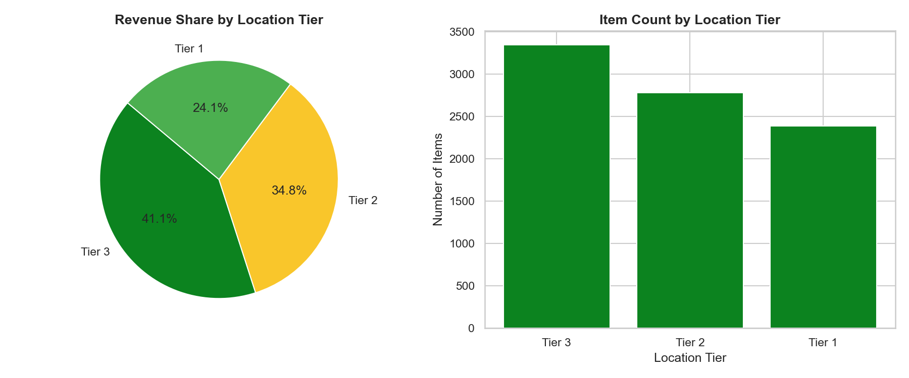
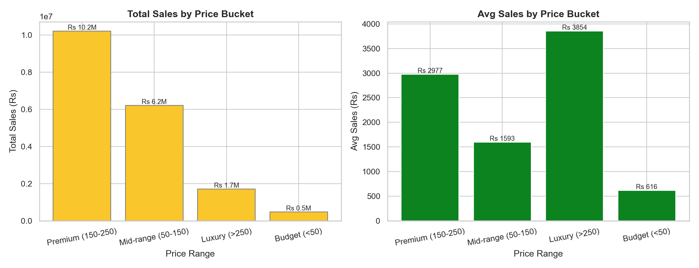
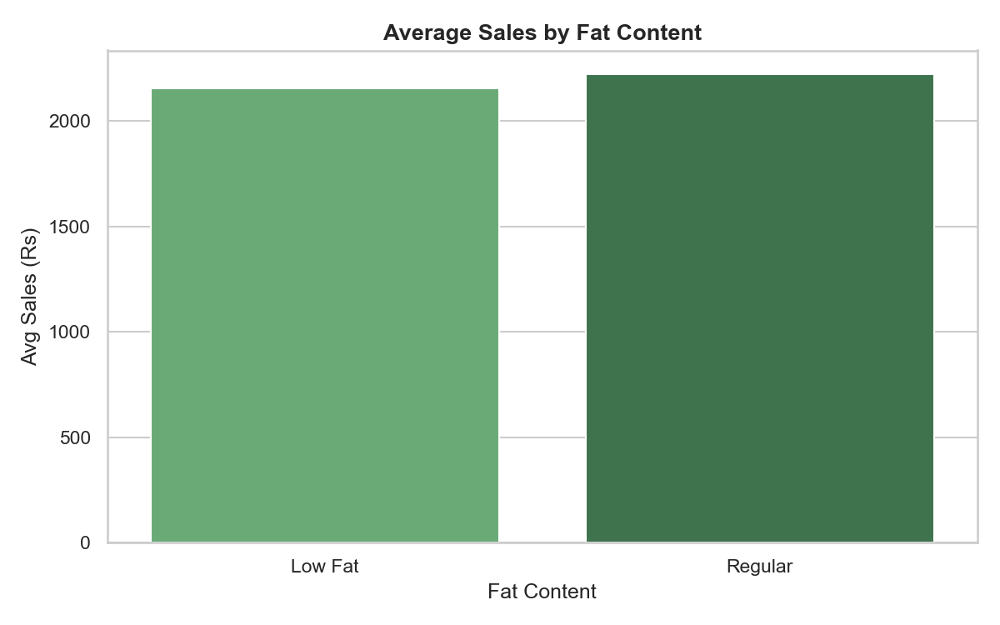
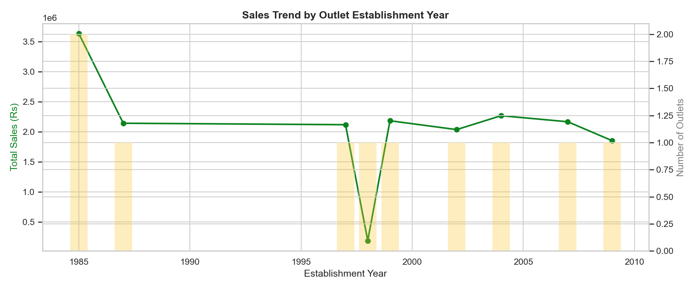
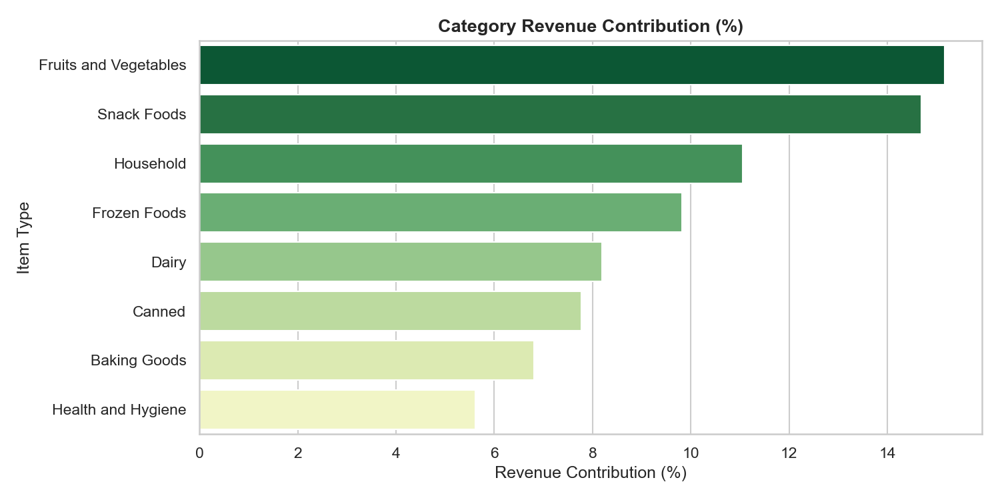
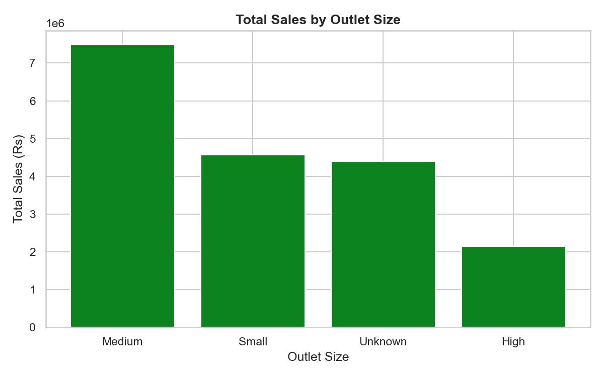
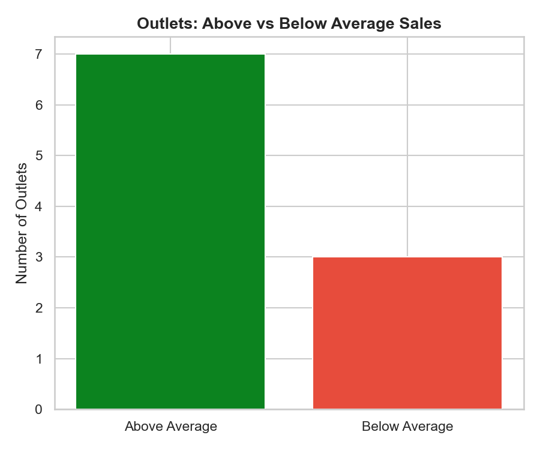

# 🛒 Blinkit Grocery Sales Analysis
### End-to-End Business Intelligence Project using SQL & Python


---

## 📌 Project Overview

This project performs a full-scale business intelligence analysis on **Blinkit's grocery sales data** — one of India's leading quick-commerce platforms. The goal is to move beyond surface-level stats and extract **actionable, retail-domain insights** using structured SQL analytics and Python-powered visualizations.

The project simulates a real-world data analyst workflow: raw data → database → SQL queries → Python pipeline → charts → business insights.

> Built as part of a Data Science & Analytics internship application at **Celebal Technologies**, demonstrating enterprise-grade analytics thinking.

---

## 🗂️ Dataset

| Property | Detail |
|---|---|
| Source | [Kaggle - Blinkit Grocery Dataset](https://www.kaggle.com/datasets/mukeshgadri/blinkit-dataset)
| Records | 8,523 rows |
| Domain | Indian Quick Commerce / Grocery Retail |

**Key Columns:**

| Column | Description |
|---|---|
| `Item_Identifier` | Unique product ID |
| `Item_Type` | Product category (e.g., Fruits, Dairy) |
| `Item_MRP` | Maximum Retail Price |
| `Item_Fat_Content` | Low Fat / Regular |
| `Item_Visibility` | Display prominence in store |
| `Outlet_Identifier` | Unique outlet ID |
| `Outlet_Type` | Supermarket Type 1/2/3, Grocery Store |
| `Outlet_Size` | Small / Medium / High |
| `Outlet_Location_Type` | Tier 1 / Tier 2 / Tier 3 |
| `Outlet_Establishment_Year` | Year outlet was established |
| `Item_Outlet_Sales` | Target — actual sales value (₹) |

---

## 🛠️ Tech Stack

| Layer | Tools |
|---|---|
| Database | MySQL 8.0 |
| Language | Python 3.10 |
| Data Manipulation | Pandas |
| Visualization | Matplotlib, Seaborn |
| DB Integration | SQLAlchemy, mysql-connector-python |
| IDE | VS Code |

---

## 📁 Project Structure

```
blinkit-sales-analysis/
│
├── setup.py                  # Database creation + CSV ingestion
├── analysis.py               # Full analytics pipeline (SQL + Python)
├── analysis.sql              # Standalone SQL queries (all analyses)
│
├── charts/
│   ├── 1_sales_by_outlet_type.png
│   ├── 2_top_item_types.png
│   ├── 3_sales_by_location.png
│   ├── 4_price_bucket_analysis.png
│   ├── 5_fat_content_sales.png
│   ├── 6_establishment_year_trend.png
│   ├── 7_category_contribution.png
│   ├── 8_outlet_size_performance.png
│   └── 9_outlet_performance.png
│
├── data/
│   └── blinkit_dataset.csv   # Raw dataset
│
└── README.md
```

---

## ⚙️ Setup & Installation

```bash
# 1. Clone the repository
git clone https://github.com/YOUR_USERNAME/blinkit-sales-analysis.git
cd blinkit-sales-analysis

# 2. Install dependencies
pip install pandas matplotlib seaborn sqlalchemy mysql-connector-python

# 3. Configure MySQL credentials in setup.py
# (default: root / root123 / localhost)

# 4. Load data into MySQL
python setup.py

# 5. Run the full analytics pipeline
python analysis.py
```

---

## 🔍 Analysis Performed

### 1. Sales by Outlet Type
Supermarket Type1 drives the largest total revenue (~₹1.3Cr), reflecting its scale advantage. However, Supermarket Type3 leads in average sales per transaction (~₹3,700), indicating a premium customer base with higher basket sizes.

**Business Implication:** Scale up Type1 for volume growth; invest in Type3 for profitability per transaction.



---

### 2. Top Item Types by Revenue
Fruits & Vegetables and Snack Foods are the highest-grossing categories — each contributing ~15% to total revenue. Household products rank 3rd, revealing strong non-food basket behaviour.

**Business Implication:** Prioritise inventory depth and promotions for these categories to protect revenue base.



---

### 3. Location Tier Analysis
Tier 3 cities account for 41.1% of total revenue despite being typically underserved markets. Tier 2 contributes 34.8%, while Tier 1 contributes only 24.1%.

**Business Implication:** Tier 3 represents Blinkit's highest-growth opportunity — strong demand exists in smaller cities, making them a strategic expansion priority.



---

### 4. Price Bucket Analysis
Premium-priced items (₹150–250 MRP) generate the highest total sales volume. Luxury items (>₹250) command the highest average sale value per transaction (~₹3,850).

**Business Implication:** Premium pricing is the revenue sweet spot — high demand and strong margins. Curate luxury product sections to increase average order value.



---

### 5. Fat Content Analysis
The dataset shows four labels for fat content (Low Fat, LF, Regular, reg) — indicating a **data quality issue** where the same values were entered inconsistently. After normalisation, regular fat products marginally outsell low-fat ones.

**Business Implication:** Customer preference for regular products is slightly dominant. However, the gap is small enough that health-conscious product lines remain commercially viable.



---

### 6. Outlet Establishment Year Trend
Outlets established in 1985 generate the highest total sales (~₹3.6M), with a dip around 1998. Post-2000 outlets show consistent but slightly declining performance.

**Business Implication:** Established outlets have built market trust and loyal customer bases. A sharp 1998 dip likely reflects a single low-performing outlet established that year — not a systemic trend.



---

### 7. Category Revenue Contribution (CTE Analysis)
Using SQL CTEs and cross-join revenue percentage logic, the top 8 categories collectively account for ~80% of total revenue, with Fruits & Vegetables and Snack Foods holding the top two spots.

**SQL Concepts Used:** CTEs, CROSS JOIN, percentage contribution calculation.



---

### 8. Outlet Size Performance
Medium-sized outlets lead in total revenue (~₹7.4M), outperforming both Small (~₹4.6M) and High (~₹2.1M) outlets.

**Business Implication:** Medium stores hit the operational sweet spot — enough SKU variety to serve customers without the overhead inefficiency of large-format stores. This has strategic implications for Blinkit's dark store expansion model.



---

### 9. Outlet Performance Benchmarking (Window Functions + CTE)
Using SQL `RANK() OVER(PARTITION BY ...)` and a CTE-based benchmark comparison, 7 out of 10 outlets perform **above** the overall average sales baseline.

**SQL Concepts Used:** Window Functions (RANK, PARTITION BY), CTEs, CASE-based conditional classification.



---

## 🧠 SQL Concepts Demonstrated

| Concept | Where Used |
|---|---|
| `GROUP BY` + Aggregates | All analyses |
| `CASE` statements | Price bucket segmentation, performance classification |
| CTEs (`WITH` clause) | Revenue contribution, above/below average benchmarking |
| Window Functions (`RANK OVER PARTITION BY`) | Regional outlet ranking |
| `CROSS JOIN` | Revenue percentage calculation |
| Running totals | Cumulative sales by outlet type |
| Subqueries | Nested average benchmarking |

---

## 📊 Key Business Insights Summary

| # | Insight | Implication |
|---|---|---|
| 1 | Supermarket Type1 = highest revenue | Volume-first strategy works |
| 2 | Supermarket Type3 = highest avg sale | Premium outlet for profitability |
| 3 | Fruits & Snacks = top 2 categories | Protect these SKUs always |
| 4 | Tier 3 = 41% revenue share | Expand to smaller cities aggressively |
| 5 | Premium pricing = max revenue | Focus on ₹150–250 range products |
| 6 | Medium outlets = top performers | Optimal dark store size confirmed |
| 7 | 70% outlets above average | Healthy network performance |
| 8 | Fat content data has quality issues | Needs standardisation in ingestion |

---

## 🔧 Data Quality Note

The `Item_Fat_Content` column contains inconsistent labels (`Low Fat`, `LF`, `Regular`, `reg`). In a production pipeline, this would be standardised at ingestion time. This has been documented as a finding and can be addressed with:

```python
df['Item_Fat_Content'] = df['Item_Fat_Content'].replace({
    'LF': 'Low Fat', 'low fat': 'Low Fat',
    'reg': 'Regular'
})
```


## 👩‍💻 Author

**Amit Kumar**
Data Science & Analytics Enthusiast


---

> *This project was built to demonstrate practical SQL analytics, business intelligence thinking, and data storytelling using real-world Indian retail data.*
